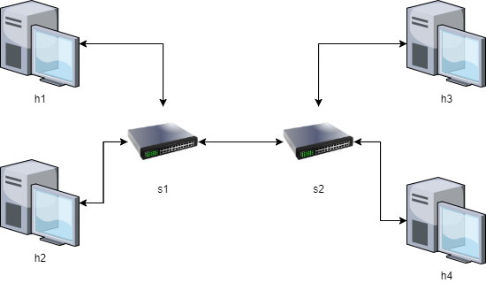
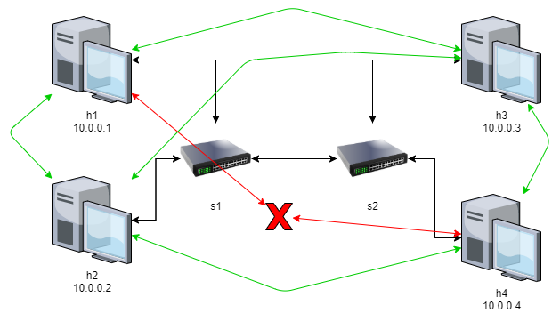

## Resumo Leitura "Redes de computadores e a Internet: uma abordagem top-down" Kurose 6ª Edição.
<details>
  <summary>Item 5.7 Um dia na vida de uma solicitação de página Web pg366</summary>

### Cenário
<p>Bob é um estudante e conecta seu notebook ao comutador Ethernet da sua escola e faz o download de uma página Web (www.google.com)</p>
<p>DNS está fora da rede interna, o roteador da escola é conectado a um ISP (Fornecedor de acesso a internet), servidor DHCP no roteador</p>


------

## 1. **DHCP** - Computador conecta a uma rede sem um IP, IP Dinamico (UDP)
  * Notebook envia um pacote para o destino (255.255.255.255) com endereço de origem IP (0.0.0.0)
  * O quadro desse pacote tem destino MAC (FF:FF:FF:FF:FF:FF) com o mac do Notebook do Bob (00:16:D3:23:68:8A)
  * O roteador recebe a requisição DHCP do notebook.
  * Cria uma mensagem ACK DHCP contendo um endereço de IP da sua faixa de rede. Assim como ip do servidor DNS, endereço IP para o roteador de borda (gateway) e o bloco da sub-rede (/24) (Máscara da rede) 
  * Toda essa mensagem tem o endereço Mac de Origem do roteador (00:22:6B:45:1F:1B) e endereço de destino do notebook do Bob (00:16:D3:23:68:8A)
  * Esse pacote(quadro) passa pelo comutador e vai direto ao destino, pois o comutador já conhece esse caminho com a autoaprendizagem.
  * O notebook do Bob recebe esse ACK DHCP e atribui as suas configurações de rede.
## 2. **DNS e ARP** - Tradutor de nomes para Endereço IP (UDP)
  *  O Notebook do Bob cria a mensagem de consulta DNS e envia pela porta 53 para ip de destino do servidor DNS que ele já conhece.
  * Esse pacote deve passar pelo roteador de borda da rede da escola, mas o Notebook do Bob não conhece o MAC do roteador de borda, então ele deve utilizar o protocol **ARP**.
  * **ARP** -> O notebook cria uma mensagem de consulta ARP direciona para o ip do roteador de borda e envia para o MAC (FF:FF:FF:FF:FF:FF -> Broadcast) que entrega para todos os dispositivos da rede. O roteador de borda recebe a consulta ARP, identifica que a requisição é para si e envia a resposta ARP indicando seu endereço MAC e envia para o comutador, para que seja entregue ao Bob.
  * Agora que o Notebook tem o endereço MAC do roteador de borda, ele envia a consulta DNS para o roteador de borda.
  * O roteador de borda recebe o pacote, verifica na sua tabela de repasse o endereço de destino, e envia para o roteador da extremidade esquerda na rede Comcast.
  * Este por sua vez recebe o pacote, verifica o endereço de destino e repassa para a interface apropriada, **sua tabela de repasse foi preenchida com protocolos intradomínio da Internet, BGP (como RIP, OSPF ou IS-IS)**.
  * Quando a consulta chega ao servidor DNS, ele procura o nome da requisição em sua base de dados e encontra o **registro de recurso DNS** que contém o IP do nome requisitado. Este dado cache foi originado no **servidor DNS com autoridade**. Sendo assim o servidor DNS monta uma mensagem DNS com resposta contendo o mapeamento entre o nome de hospedeiro e endereço IP e coloca a mensagem DNS de resposta em um segmento UDP endereçado ao notebook do Bob que é encaminhado de volta ao roteador da escolha por meio da rede Comcast e de lá chegara ao notebook do Bob
## 3. **Interação Cliente-Servidor WEB: TCP e HTTP**
  * Por fim o TCP faz a conexão (SYN - ACK) entre o servidor da Google e o notebook do Bob e o fluxo é criado.


### **Obs -Sendo assim, não esquecer:**
* **DHCP** - Atribuir IP a um computador
* **DNS** - Traduz o nome para endereço IP, pode ou não estar localizado na rede interna
* **ARP** - Requisita o endereço MAC de um IP de uma mesma rede.
* **Tabela de repasse** - Responsável por indicar ao roteador por qual interface ele deve mandar o pacote.
* **Switchs tem autoaprendizado de MAC**.

</details>


## Desafio com o controlador RYU sobre determinada topologia

<p>O objetivo da atividade é rodar o controlador RYU sobre uma topologia simulada no ambiente do Mininet e fazer com que o RYU impessa a comunicação entre dois computadores desta topologia.</p>

### Topologia para ser desenvolvida



<b>Essa topologia foi desenvolvida no código topo.py</b>
<p>Agora o objetivo é fazer com que o RYU mexa no Firewall dos switchs (s1 e s2) da topologia para que os computador (h1 e h4) não possam se comunicar.  </p>

<p>A questão é que o RYU trabalha em python e o OpenFlow funciona como uma REST_API, então é possivel desenvolver isso de duas maneiras, a primeira é configurando os switchs de forma externa, que vai ser mostrado a seguir.</p>


### Método adotado para configurar os switchs.
<details>
<summary>Clique para expandir</summary>

[Material de consulta](https://osrg.github.io/ryu-book/en/html/rest_firewall.html)

1. Rode a topologia (topo.py) usando o Putty para poder utilizar o XMing
2. Para garantir que os switchs estão sendo executados em OpenFlow 13 faça:
```
xterm s1 s2

```

```
s1 ovs-vsctl set Bridge s1 protocols=OpenFlow13
s2 ovs-vsctl set Bridge s2 protocols=OpenFlow13
```

3. Agora rode o controlador e o rest_firewall nele.

```
xterm c0
```

```
ryu-manager ryu.app.rest_firewall
```

4. Agora que a brincadeira começa de verdade, abra um terminal e cole os seguintes códigos curl, que irão fazer requisição PUT/POST no servidor REST_API para que os switchs sejam configurados.

  * Ativando o firewall nos switchs
```json
curl -X PUT http://localhost:8080/firewall/module/enable/0000000000000001
  [
    {
      "switch_id": "0000000000000001",
      "command_result": {
        "result": "success",
        "details": "firewall running."
      }
    }
  ]
```
```json
curl -X PUT http://localhost:8080/firewall/module/enable/0000000000000002
  [
    {
      "switch_id": "0000000000000002",
      "command_result": {
        "result": "success",
        "details": "firewall running."
      }
    }
  ]
```

  * Verificando se o firewall está ativo
```json
curl http://localhost:8080/firewall/module/status
```

  * Permitir comunicação de todos os protocolos no s1 para h1 -> h2

```json
curl -X POST -d '{"nw_src": "10.0.0.1/32", "nw_dst": "10.0.0.2/32"}' http://localhost:8080/firewall/rules/0000000000000001
  [
    {
      "switch_id": "0000000000000001",
      "command_result": [
        {
          "result": "success",
          "details": "Rule added. : rule_id=1"
        }
      ]
    }
  ]
```

```json
curl -X POST -d '{"nw_src": "10.0.0.2/32", "nw_dst": "10.0.0.1/32"}' http://localhost:8080/firewall/rules/0000000000000001
  [
    {
      "switch_id": "0000000000000001",
      "command_result": [
        {
          "result": "success",
          "details": "Rule added. : rule_id=2"
        }
      ]
    }
  ]
```

  * Permitir a comunicação de todos os protocolos h1->h3

  #### s1
```json
curl -X POST -d '{"nw_src": "10.0.0.1/32", "nw_dst": "10.0.0.3/32"}' http://localhost:8080/firewall/rules/0000000000000001
  [
    {
      "switch_id": "0000000000000001",
      "command_result": [
        {
          "result": "success",
          "details": "Rule added. : rule_id=3"
        }
      ]
    }
  ]
```

```json
curl -X POST -d '{"nw_src": "10.0.0.3/32", "nw_dst": "10.0.0.1/32"}' http://localhost:8080/firewall/rules/0000000000000001
  [
    {
      "switch_id": "0000000000000001",
      "command_result": [
        {
          "result": "success",
          "details": "Rule added. : rule_id=4"
        }
      ]
    }
  ]
```

  #### s2
```json
curl -X POST -d '{"nw_src": "10.0.0.1/32", "nw_dst": "10.0.0.3/32"}' http://localhost:8080/firewall/rules/0000000000000002
  [
    {
      "switch_id": "0000000000000002",
      "command_result": [
        {
          "result": "success",
          "details": "Rule added. : rule_id=5"
        }
      ]
    }
  ]

```

```json
curl -X POST -d '{"nw_src": "10.0.0.3/32", "nw_dst": "10.0.0.1/32"}' http://localhost:8080/firewall/rules/0000000000000002
  [
    {
      "switch_id": "0000000000000002",
      "command_result": [
        {
          "result": "success",
          "details": "Rule added. : rule_id=6"
        }
      ]
    }
  ]
```
  * Permitir a comunicação de todos os protocolos h2->h3

  #### s1
```json
curl -X POST -d '{"nw_src": "10.0.0.2/32", "nw_dst": "10.0.0.3/32"}' http://localhost:8080/firewall/rules/0000000000000001
  [
    {
      "switch_id": "0000000000000001",
      "command_result": [
        {
          "result": "success",
          "details": "Rule added. : rule_id=7"
        }
      ]
    }
  ]
```

```json
curl -X POST -d '{"nw_src": "10.0.0.3/32", "nw_dst": "10.0.0.2/32"}' http://localhost:8080/firewall/rules/0000000000000001
  [
    {
      "switch_id": "0000000000000001",
      "command_result": [
        {
          "result": "success",
          "details": "Rule added. : rule_id=8"
        }
      ]
    }
  ]
```

  #### s2
```json
curl -X POST -d '{"nw_src": "10.0.0.2/32", "nw_dst": "10.0.0.3/32"}' http://localhost:8080/firewall/rules/0000000000000002
  [
    {
      "switch_id": "0000000000000002",
      "command_result": [
        {
          "result": "success",
          "details": "Rule added. : rule_id=9"
        }
      ]
    }
  ]
```

```json
curl -X POST -d '{"nw_src": "10.0.0.3/32", "nw_dst": "10.0.0.2/32"}' http://localhost:8080/firewall/rules/0000000000000002
  [
    {
      "switch_id": "0000000000000002",
      "command_result": [
        {
          "result": "success",
          "details": "Rule added. : rule_id=10"
        }
      ]
    }
  ]
```

  * Permitir a comunicação de todos os protocolos h3->h4
```json
curl -X POST -d '{"nw_src": "10.0.0.4/32", "nw_dst": "10.0.0.3/32"}' http://localhost:8080/firewall/rules/0000000000000002
  [
    {
      "switch_id": "0000000000000002",
      "command_result": [
        {
          "result": "success",
          "details": "Rule added. : rule_id=11"
        }
      ]
    }
  ]
```

```json
curl -X POST -d '{"nw_src": "10.0.0.3/32", "nw_dst": "10.0.0.4/32"}' http://localhost:8080/firewall/rules/0000000000000002
  [
    {
      "switch_id": "0000000000000002",
      "command_result": [
        {
          "result": "success",
          "details": "Rule added. : rule_id=12"
        }
      ]
    }
  ]
```

  * Permitir a comunicação de todos os protocolos h2->h4

  #### s1
```json
curl -X POST -d '{"nw_src": "10.0.0.2/32", "nw_dst": "10.0.0.4/32"}' http://localhost:8080/firewall/rules/0000000000000001
  [
    {
      "switch_id": "0000000000000001",
      "command_result": [
        {
          "result": "success",
          "details": "Rule added. : rule_id=13"
        }
      ]
    }
  ]
```

```json
curl -X POST -d '{"nw_src": "10.0.0.4/32", "nw_dst": "10.0.0.2/32"}' http://localhost:8080/firewall/rules/0000000000000001
  [
    {
      "switch_id": "0000000000000001",
      "command_result": [
        {
          "result": "success",
          "details": "Rule added. : rule_id=14"
        }
      ]
    }
  ]
```

  #### s2

```json
curl -X POST -d '{"nw_src": "10.0.0.2/32", "nw_dst": "10.0.0.4/32"}' http://localhost:8080/firewall/rules/0000000000000002
  [
    {
      "switch_id": "0000000000000002",
      "command_result": [
        {
          "result": "success",
          "details": "Rule added. : rule_id=15"
        }
      ]
    }
  ]
```

```json
curl -X POST -d '{"nw_src": "10.0.0.4/32", "nw_dst": "10.0.0.2/32"}' http://localhost:8080/firewall/rules/0000000000000002
  [
    {
      "switch_id": "0000000000000002",
      "command_result": [
        {
          "result": "success",
          "details": "Rule added. : rule_id=16"
        }
      ]
    }
  ]
```
5. Checar as regras no switch
```
xterm s1 s2
``` 

```
ovs-ofctl -O openflow13 dump-flows s2
ovs-ofctl -O openflow13 dump-flows s2
```

<p>Com isso eu consegui delimitar a comunicação entre o h1 e o h4, e permitir que todos os outros computadores da rede pudessem se comunicar, mas o ideal seria que pudesse configurar isto através do python utilizando o RYU, que será descrito abaixo.</p>
</details>

## Utilizando o RYU para monitoramento de rede

<p> Agora o objetivo é utilizar o RYU para monitorar o tráfego da rede.</p>
<p> Para isto vamos adotar a mesma topologia do exemplo anterior.</p>

<p> **Materiais de Consulta:** </p>

[Switch HUB by OSRG](https://osrg.github.io/ryu-book/en/html/switching_hub.html#ch-switching-hub)

[Traffic Monitor by OSRG](https://osrg.github.io/ryu-book/en/html/traffic_monitor.html)

[Traffic Monitor by CheHsuan](https://github.com/CheHsuan/RYU-TrafficMonitorApp)

### simple_monitor_13.py

<details>
<summary>Clique para expandir.</summary>

<p>Aplicação para monitoramento do tráfego, implementada pela OSRG sobre um Switch HUB (Switch que faz ações simples como autoaprendizagem, etc...) com o adicional de uma thread que periodicamente faz requisições para o switch OpenFlow para adquirir informações estatísticas. Está thread está implementada em <code>ryu.lib.hub</code>, especificamente no <code>hub.spawn()</code> que usa o eventlet green thread.</p>

#### <code>_monitor</code>
* Função da thread que faz a requisição  a cada 10 segundos.

#### <code> _state_change_handler </code>

* <code>EventOFPStateChange</code>
  * Para ter certeza que o switch conectado está sendo monitorado essa flag é utilizada para detectar conexões e desconexões.
  * Isso é emitido pelo RYU quando o estado do Datapath é alterado.
* <code>MAIN_DISPATCHER</code>
  * Switch-features message received and sent set-config message
  * Quando o estado do Datapath se torna este, o switch torna-se o alvo de monitoramento
* <code>DEAD_DISPATCHER</code>
  * Disconnect from the peer. Or disconnecting due to some unrecoverable errors.
  * Quando o datapath troca para este estado, o registro é deletado do monitor.

#### <code>_request_stats()</code>
* Função periodicamente chamada para requisitar informações estatisticas para o switch.
* <code>OFPFlowStatsRequest</code>
  * The controller uses this message to query individual flow statistics.
* <code>OFPPortStatsRequest</code> 
  * The controller uses this message to query information about ports statistics.
  * <code>OFPP_ANY</code> - Flag to request information from all ports.


</details>